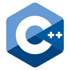

<h1 align="center">Hi 👋, I'm Harrison</h1>
<h3 align="center">A passionate compiler developer</h3>

🌱 I'm a software engineer working on the AMD GPU compiler.

🎓 I'm a graduate student at East China Normal University.

💬 Feel free to ask me about anything you like!

💙 I’m passionate about compiler development, especially LLVM, MLIR, and GPU compilers. I contribute to LLVM because I enjoy it, and I want to make the compiler world a bit better.

<h3 align="left">Languages and Tools:</h3>
<table>
	<tr>
		<td align="center"></td>
		<td align="center"></td>
		<td align="center"></td>
		<td align="center"></td>
		<td align="center"></td>
		<td align="center"></td>
		<td align="center"></td>
		<td align="center"></td>
		<td align="center"></td>
		<td align="center"></td>
	</tr>
</table>
